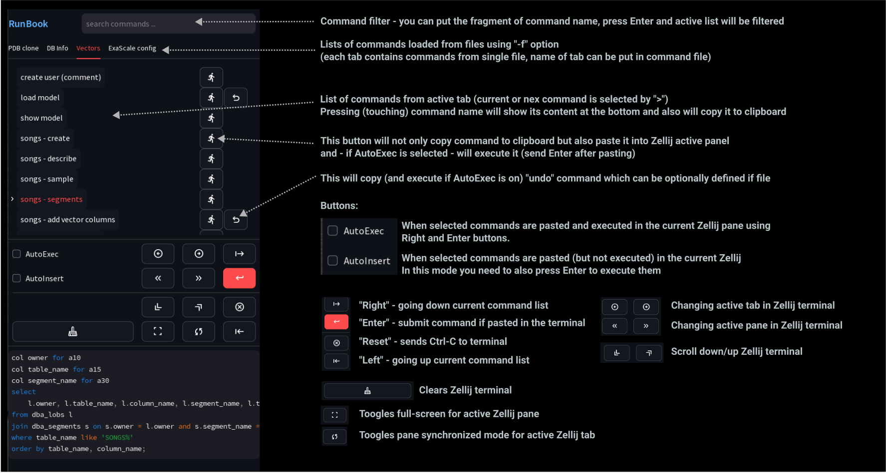
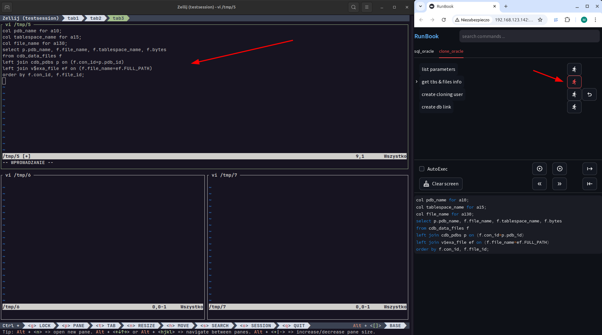

# RunBook
Simple application for lazy instructors and speakers who like live demos but do not remember all the commands.

It supposed to be used with great [Zellij](https://zellij.dev/) terminal multiplexer used during live demo 
(but without it you can still use it to copy commands to clipboard)

USAGE

```shell
Usage: ./runbook.sh [-s zellij_session_name] -f command_file [-f command_file ...] [-p] [-d]
  -s zellij_session_name    - Name of Zellij session where commands will be (optionally) executed
  -f command_file           - One or more command files in TOML format
  -p                        - Requires login password (from .streamlit/secrets.toml file)
  -d                        - Debug mode
```

# Installation

You need to have Python 3 installed (not covered in this instruction).  
Also Zellij is only available for Linux and macOS. Zellij is not mandatory - but highly recommended.
It should be quite easy to modify runbook.py for `tmux` (but I don't like tmux) or other terminal multiplexer 
which supports remote commands.

Clone repository:
```shell
cd <your_choosen_dir>
git clone https://github.com/wes-pro/runbook.git
cd runbook
```
Create Python virtual environment, activate it and install requirement:
```shell
python3 -m venv venv
. venv/bin/activate
pip install -r requirements.txt
```


# How to use

1. Create Zellij layout file (see [test_layout.kdl](test_layout.kdl))
2. Start Zellij session using layout file (see [start_zellij_session.sh](start_zellij_session.sh))
3. Create one or more TOML files with commands you use during live demo (see [commands/sql.toml](commands/sql.toml))
4. Start runbook.sh providing zellij session name and one or more command files:
```shell
./runnbook.sh -s test -f commands/sql.toml -f commands/clone.toml
```

Add `-d` to enable detailed login.  

If you need password protection then catalog create subdirectory and file `.streamlit/secrets.toml` 
under working RunBook directory and put this inside:
```shell 
password = "your password"
```
Then add `-p` when you start `runbook.sh`


EXAMPLE:
* In one, usually big or full screen terminal (this will be your live demo screen) start Zellij providing session name and layout file:
```shell
cd <runbook_directory>
zellij -l test_layout.kdl attach --create testsession -f
```
This will create new session of attach to existing of the same name (see Zellij documentation for details).  
You can also use simple wrapper script:
```shell ./start_zellij_session.sh test_layout.kdl testsession ```

* In different terminal (not visible to the audience) start RunBook application:
```shell
./runbook.sh -s testsession -f commands/sql.toml -f commands/clone.toml 

  You can now view your Streamlit app in your browser.

  Local URL: http://localhost:8501
  Network URL: http://192.168.1.142:8501
  External URL: http://88.13.14.231:8501
```

Now connect to application from web browser on your computer of better from your mobile phone if you have 
WiFi connectivity between your laptop and mobile (I usually start WiFi tethering during presentation)

From now on in the browser you will this simple interface:

And you can now lookup, search and copy your commands to clipboard or paste them directly to Zellij active pane:

